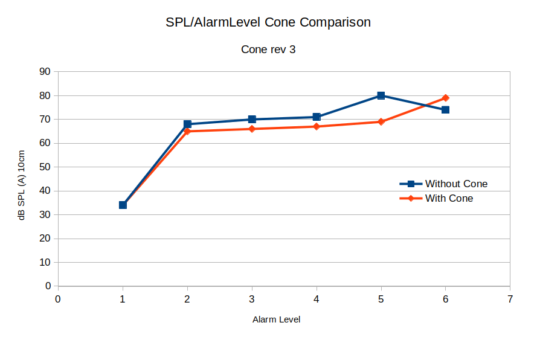

# BuzzerHorn
A BuzzerHorn to Fit a Piezo Transducter, 12.2mm x 6.5mm on the GPAD.  
A FreeCad project.  

### Buzzer horn on GPAD assembly

### First Test Results 20221202
Test on DUT serial numbers 2.  
Tested with GPAD version 0.03 Firmware.
Version 0.3 firm ware sets the following frequencies for alarms a0 to a5.
>const int BUZZER_LVL_FREQ_HZ[]= {0,128,256,512,1024,2048};

Measurment was made verticaly above the DUT. The DUT was placed on a table top with the transducer pointed up. So the measurement was on axis. 
Forrest noticed that he could hear Alarms at A2 which he did not hear before.  
Measure SPL at A0-A5 with and with out the BuzzerHorn.  
Tested at 10cm from transducter. No enclosure.  
Here is a plot of the amplitude as measreud by TBD SPL meter.  

Note althought the measured SPL for with Buzzer Horn was lower on axis the buzzer could be heard off axis perhaps better.

### Tagged Version Descriptions
I have made several guesses at shapes to try each time making tweeks for fit to GPAD Version 1 PCB.

Version 3.0  

Version 3.0 Reduce top diamter to about 0.6 inch so will not interfer with LED D201 on GPAD.

Version 2.0  
  
With fillet at appature.

Version 1.0  
  
Sharp corner at appature.

### Buzzer Information
This horn is designed for a buzzer part I found at JLCPCB: **https://jlcpcb.com/partdetail/Tdk-PS1240P02BT/C76871**  
Data sheet for buzzer at: **https://datasheet.lcsc.com/lcsc/1811032111_TDK-PS1240P02BT_C76871.pdf**  

# Slicer project and GCODE
A PrusaSlicer Project file containing various rotations, as well as generated gcode from the same.
